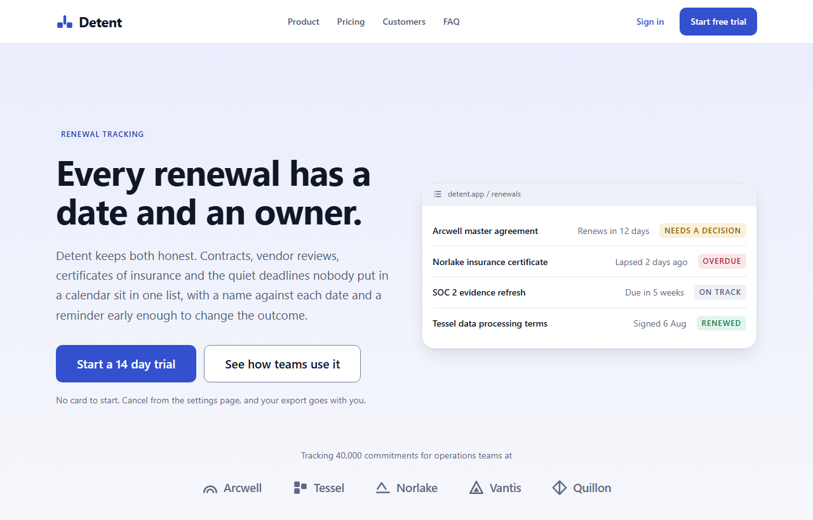

<!-- The screenshot above is a real render of demo/index.html, not a mock. If you
     change the demo, regenerate it in the same run or this README starts lying.
     From the repository root:

       npx --yes playwright@1.59.1 screenshot --viewport-size="1280,820" \
         --wait-for-timeout=500 "file://$(pwd)/demo/index.html" assets/hero.png

     On Windows under Git Bash, use $(pwd -W) so the file URL carries the drive
     letter. The version is pinned because the capture is byte reproducible
     within a Chromium build and not across them: two runs on 1.59.1 produce
     the same md5, and a different Playwright brings a different Chromium and
     a few different pixels. If the browser is missing, run
     `npx playwright@1.59.1 install chromium` first. -->

The polished SaaS standard. Clean neutral grounds, one restrained brand accent, soft small shadows, medium radii, generous section rhythm, and the social proof and pricing patterns treated as components rather than as page furniture. Stripe sits here. Linear sits here. Notion's marketing site sits here.

This is the web's default professional dialect, and that is the point. The value in this repository is not a look you have never seen. It is the look you have seen a thousand times, executed correctly: a spacing scale that holds one rhythm, a type scale with real distance between its steps, and contrast measured rather than eyeballed. The position's own failure mode is being interchangeable, and the only defence against it is craft inside the convention.

## The demo

The screenshot above is [`demo/index.html`](demo/index.html), a fictional B2B renewal tracker called Detent. Clone the repo and open the file. There is no build step, no framework, no `node_modules`, and no server to start.

<!-- TODO(public flip): once this repo is public and GitHub Pages is turned on for
     the default branch, replace the relative link above with
     https://rampstackco.github.io/saas-landing-theme/demo/ -->

The demo declares no colour of its own. It links `tokens/tokens.css`, `components/components.css` and `components/sections.css` and reads every value from them, so it stays honest about what the theme actually produces.

There is a second page worth opening: [`components/index.html`](components/index.html) renders all seven components with their variants and the markup to copy.

## Position map

A visual style is a set of coordinates, not a mood. This theme sits at one point in the [creative direction framework](https://rampstack.co/framework/creative-direction), which sets brand direction on four axes. Here is where this register lands and what each choice pays for.

| Axis | Position | What the position buys |
| --- | --- | --- |
| Tone register | [Conversational](https://rampstack.co/framework/tone/conversational) | A voice that can write "the quiet deadlines nobody put in a calendar" without either winking or presenting. Warm enough to read as a person, precise enough to survive a procurement review. |
| Aesthetic philosophy | [Polished Standard](https://rampstack.co/framework/aesthetic/polished-standard) | The conventions a reader already knows how to scan, so nothing on the page has to be learned before it can be evaluated. This register **is** the convention, which makes execution the only differentiator available. |
| Audience relationship | [Peer](https://rampstack.co/framework/relationship/peer) | A 10px radius on the control the reader's hand meets, and a price on the page. Square corners would address a console operator; a pill would address a consumer. |
| Sensory ambition | [Considered](https://rampstack.co/framework/sensory/considered) | Shadows that stay under 0.12 alpha, one gradient wash, a two pixel hover. The reader registers that someone calibrated this without being able to point at the moment they noticed. |

Those four position names are the exact strings the framework uses. If you want the long version of any of them, the links go to the position page.

The framework's own canonical archetype for this register, Observatory Standard, sits at exactly these four coordinates and cites Stripe, Notion, Linear and modern B2B SaaS as its references. The coordinates here are copied from it rather than argued to.

## Quick start

Clone once, then pick the path that matches your stack.

```bash
git clone --depth 1 https://github.com/rampstackco/saas-landing-theme
```

**Plain CSS.** Copy the two directories and link the files in order. This is the whole install.

```bash
cp -r saas-landing-theme/tokens saas-landing-theme/components your-project/styles/
```

```html
<link rel="stylesheet" href="/styles/tokens/tokens.css" />
<link rel="stylesheet" href="/styles/components/components.css" />
<link rel="stylesheet" href="/styles/components/sections.css" />
```

The third line is the landing page layer. A product application needs the first two and nothing else.

**Tailwind v4.** One import. `theme.css` pulls in `tokens.css` and maps it onto Tailwind's theme namespaces, so you get `bg-sl-brand`, `shadow-sl-sm`, `rounded-sl-lg`, `text-sl-h2`.

```css
@import "tailwindcss";
@import "./styles/tokens/theme.css";
```

**Tailwind v3.** Load the tokens in your stylesheet, then register the preset.

```css
@import "./styles/tokens/tokens.css";
@tailwind base;
@tailwind components;
@tailwind utilities;
```

```js
// tailwind.config.js
module.exports = {
  presets: [require("./styles/tokens/preset.js")],
  content: ["./src/**/*.{html,js,jsx,ts,tsx}"],
};
```

**Already on shadcn/ui.** The tokens are namespaced `--sl-*` so they will not clobber yours. Bridge the two in your global stylesheet and shadcn's components inherit the register:

```css
:root {
  --background: var(--sl-ground);
  --foreground: var(--sl-ink);
  --card: var(--sl-surface);
  --muted: var(--sl-surface-muted);
  --muted-foreground: var(--sl-ink-muted);
  --primary: var(--sl-brand);
  --primary-foreground: var(--sl-brand-ink);
  --destructive: var(--sl-danger);
  --border: var(--sl-border);
  --input: var(--sl-border-control);
  --ring: var(--sl-ring);
  --radius: var(--sl-radius);
}
```

Two of those deserve a note. shadcn maps `--border` and `--input` to the same value by default; they are different tokens here because a divider and the edge of a text field have different contrast obligations, and the section below explains why that matters more in this register than in a louder one.

## Where the reasoning lives

[`tokens/tokens.css`](tokens/tokens.css) is the single source of truth. Every literal value in the theme appears there exactly once; `theme.css` and `preset.js` hold no values of their own and point back at it with `var()`. Change a hex there and the demo, the components, the section patterns and both Tailwind adapters follow.

The file is annotated. Each group of tokens carries a comment naming the axis the choice serves and why, so the elevation tokens explain themselves:

```css
/* ELEVATION
   Sensory ambition axis. Four steps, none above 0.12 alpha, all of them
   small. The shadow in this register separates a surface from the ground
   and stops there; a large soft shadow reads as a card floating in a room
   and moves the page toward a position it is not at. */
```

[`CUSTOMIZE.md`](CUSTOMIZE.md) is the half-finished layer, and it is half-finished deliberately. It documents retheming as axis moves rather than as a colour picker: pick an axis, move along it, change the two or three tokens that carry the move. One move is worked through with before and after values. Two more are sketched so the format is obvious enough to finish yourself.

### The section layer

Borders, shadows and type give you components. What makes a landing page in this register work is the arrangement, and that lives in [`components/sections.css`](components/sections.css).

A token file can hold 96px and it can hold 64px. What it cannot hold is the fact that a section takes one of them and the hero takes the next step up, or that the gap between a headline and the sentence under it is one step while the gap between that sentence and the buttons is three. The section layer holds those relationships: the hero and its proof strip, the feature triptych, the pricing section, the testimonial band, the FAQ, and the final call to action.

Delete it and the tokens still resolve and the components still render. What is left is a set of components with nothing holding them in an order, which is a different thing from a page.

### The measured parts

Two claims in this repository are the kind that quietly rot, so both are scripts rather than sentences.

`node verify/contrast.mjs` recomputes every contrast ratio written into `tokens.css` from the values in that file, against both ends of each gradient, and fails if a pairing drops below its floor. All 37 pairings clear: 4.5:1 for text, 3:1 for the lines that tell a reader where a control is.

That second floor is where this register is most often wrong. The category habit is one light grey for every line on the page, which puts a text field's border at about 1.3:1 against white and fails [WCAG 1.4.11](https://www.w3.org/WAI/WCAG21/Understanding/non-text-contrast.html). This theme carries two line colours: `--sl-border` for dividers and card edges, which are decoration, and `--sl-border-control` at 3.48:1 for anything a reader has to find in order to use it.

`node verify/namespaces.mjs` compiles `tokens/theme.css` through Tailwind and checks that all 80 entries emit the property they claim while carrying their `var()`. `node verify/probe.mjs` proves the negative half: the control run, the namespaces that generate nothing at all, and two traps where the class compiles and sets the wrong property. Both need Tailwind installed, which the theme itself does not:

```bash
npm install --no-save tailwindcss@4 @tailwindcss/postcss@4 postcss
node verify/namespaces.mjs
```

The results, and the four undocumented namespaces this adapter depends on, are written up in the header of [`tokens/theme.css`](tokens/theme.css).

### Consuming this from a Claude skill

The [`design-standards`](https://github.com/rampstackco/claude-skills/tree/main/skills/design-standards) skill asks for a project's design tokens as a required input and offers to define a working set when none exist. Point it at `tokens/tokens.css` instead. The file covers every category the skill asks for, in the order it asks: colour with measured contrast ratios, spacing scale, type scale, radius. Every text pairing in it clears WCAG AA, and the ratios are in the comments, so the skill's contrast pass has nothing left to compute.

## The base, and when to leave it

Most teams should start here. Not because this register is the best one, but because it is the one the reader already knows, which means every deviation from it costs the reader something and has to be worth what it costs. Build the page at this position first, get the spacing and the contrast right, and then decide whether the brand needs a louder position badly enough to spend the familiarity.

If it does, the sibling repositories in this collection are the same discipline at other coordinates: the same token structure, the same adapters, the same verification, pointed at registers that ask more of the reader. <!-- TODO(siblings): link the neobrutalism, glassmorphism, swiss, bento and brutalist siblings here once they are all public. -->

Composing rather than switching is normal. This register is the foundation under most of them: glassy surfaces, hard offset shadows and mosaic grids are all treatments that get applied on top of a page whose spacing and contrast were already correct. <!-- TODO(siblings): link the glassmorphism sibling here once it ships. -->

## Adjacency: this is not a component library

This repository styles the surface. It does not ship behaviour, a JavaScript bundle, or a React package, and the pricing toggle in the demo is a radio group driven by a CSS `:has()` rule rather than a listener.

That boundary is deliberate. A component library owns state, and owning state means owning your framework choice, your bundler and your upgrade path. This owns none of them, which is what makes it something you can put underneath shadcn/ui, Mantine, a Rails application or a static page without asking any of them to move.

If you want the components with behaviour attached, that is a different kind of project and this is not it.

## License and questions

MIT. See [LICENSE](LICENSE). Use it commercially, fork it, rename the tokens, ship it. No attribution required.

Issues and pull requests are welcome here. For questions, ideas, and anything conversational, use [the discussions on the claude-skills repo](https://github.com/rampstackco/claude-skills/discussions), which is where all discussion for these repos lives.
